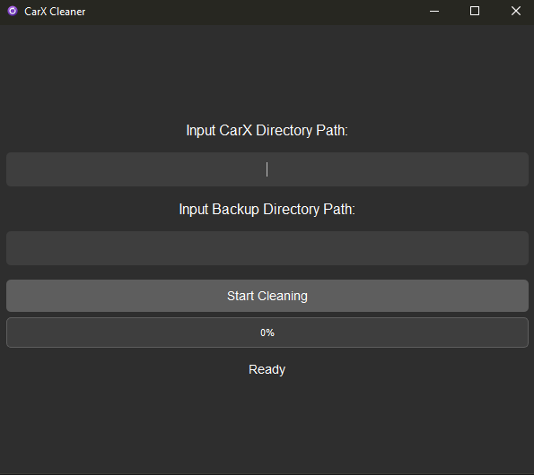

<p align="center">
  
</p>

<p align="center">
  CarX Cleaner is a tool that is designed to remove mods from CarX eliminating the requirement to do so manually. This tool ensures that only un-original (modded) files and directories are removed, preserving the integrity of the original game files.
</p>

<h2 align="center">Features</h2>
<p align="center">
 Removes un-original files and directories
 </p>
 <p align="center">
 Preserves original files and directories
</p>
<p align="center">
User-friendly PyQt5 GUI
</p>
<p align="center">
Supports relative paths for universal compatibility
</p>


<h2 align="center">Installation</h2>
<p align="center">
</p>

<p align="center">
<strong>Prerequisites:</strong>
</p>

<p align="center">
Python 3.x
</p>
<p align="center">
PyQt5
</p>

<h2 align="center">Steps</h2>
<p align="center">
</p>


<p align="center">
<strong>Clone into the Repository:</strong>
</p>

    git clone https://github.com/Elixir-Elf/CarX-Cleaner.git
    cd CarX-Cleaner


<p align="center">
<strong>Install the required dependencies:</strong>
</p>

    pip install -r requirements.txt


<p align="center">
<strong>Run the application:</strong>
</p>

    python main.py

<h2 align="center">Usage</h2>
<p align="center">
</p>

<p align="center">
<strong>Input the game directory path:</strong>
<p align="center">
Open the application and input the full directory path of the game installation in the provided text box.
</p>

<p align="center">
<strong>Start the cleaning process:</strong>
<p align="center">
Click the "Start Cleaning" button to begin the cleaning process. The progress bar will update to show the progress, and the status label will indicate the current status (Ready, In-Progress, Completed, Error).
</p>

<h2 align="center">Contributing</h2>
<p align="center">
Contributions are welcome! Please follow these steps to contribute:
</p>

```sh
1. Fork the repository
2. Create a new branch (`git checkout -b feature-branch`)
3. Commit your changes (`git commit -am 'Add new feature'`)
4. Push to the branch (`git push origin feature-branch`)
5. Create a new Pull Request
```

<h2 align="center">License</h2>
<p align="center">
This project is licensed under the MIT License. See the LICENSE file for details.
</p>

<h2 align="center">Screenshot</h2>
<p align="center">
  
</p>
</p>

<h2 align="center">Acknowledgements</h2>
<p align="center">
Special thanks to <a href="https://github.com/pepe-wizard">pepe-wizard</a> for providing massive amounts of support and code snippets!
</p>
